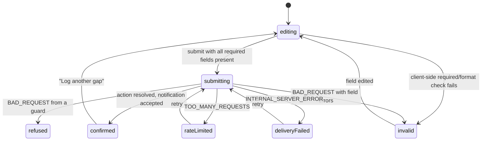

# Phase 1 Data Model: Dirtyworks.ai Public Marketing Website

**Date**: 2026-08-25 | **Plan**: [plan.md](./plan.md) | **Spec**: [spec.md](./spec.md)

There is no database. Two kinds of data exist: **build-time content models** (typed modules under
`src/content/`, consumed by `.astro` components and validated by unit tests) and one **transient
runtime payload** (the intake submission, validated, sent, and discarded). Field names below are
normative — the notification template, the unit tests, and the content check all key on them.

---

## 1. Build-time content models

### RouteEntry — `src/content/routes.ts`

The single source for routing, metadata, navigation membership, and publication gating.

| Field | Type | Rules |
|---|---|---|
| `id` | `'home' \| 'services' \| 'catalogue' \| 'method' \| 'trust' \| 'msps' \| 'about' \| 'notes' \| 'start'` | unique |
| `path` | `string` | exactly one of the nine paths in [contracts/routes.md](./contracts/routes.md); no trailing slash |
| `title` | `string` | verbatim from `mockups/README.md`; ≤70 chars |
| `description` | `string \| null` | verbatim where specified; `null` where the handoff gives none |
| `inHeaderNav` | `boolean` | true for the five primary items only |
| `footerColumn` | `'service' \| 'company' \| null` | Legal column holds no routes (inert text) |
| `headerAction` | `'buyer' \| 'partner' \| 'current'` | `partner` on `/msps`, `current` on `/start`, else `buyer` |
| `ctaPrimary` | `RouteId` | per the CTA map; `/start` has none |
| `ctaSecondary` | `RouteId \| null` | per the CTA map |
| `published` | `boolean` | `false` gates the route out of the build and out of navigation |

**Invariants** (unit-tested, FR-003 / SC-012): every `path` resolves to a file in `src/pages/`; every
published route appears in header nav or a footer column; every `ctaPrimary`/`ctaSecondary` names a
published route; `id` and `path` are both unique. A route with `published: false` must not appear in
any navigation surface, sitemap, or CTA target.

### NavItem — derived, not authored

Derived from `RouteEntry` for `SiteHeader`, `SiteFooter`, and the mobile panel. Deriving rather than
authoring is what makes a renamed page unable to orphan a link (FR-003). Shape: `{ id, label, path,
active }`. `active` is computed per page, never stored.

### Placeholder — `src/content/placeholders.ts`

| Field | Type | Rules |
|---|---|---|
| `key` | `string` | unique, screaming-snake (e.g. `FOUNDER_NAME`) |
| `state` | `'OPEN_GAP' \| 'LEGAL_REVIEW'` | drives the rendered stamp text and the gate severity |
| `owner` | `string` | who must supply it (e.g. `sponsor`, `counsel`) |
| `blocksRoutes` | `RouteId[]` | routes that cannot publish while this is unresolved |
| `note` | `string` | what is required, in plain language |

**State transition**: `unresolved` → `resolved` happens only by deleting the entry and replacing its
render site with real content. There is no "resolved" value — a present entry is unresolved. The
content check fails the release while any entry names a published route (FR-023, FR-024, SC-008).

### ClaimStamp — `src/types/claims.ts`

Closed union, rendered by `ClaimStamp.astro`:
`'ILLUSTRATIVE' | 'VERIFY AT QUOTE' | 'OPEN GAP' | 'LEGAL REVIEW' | 'HYPOTHESIS — NOT MEASURED'`
(the last uses an em dash, U+2014). `ILLUSTRATIVE` and `VERIFY AT QUOTE` **must** survive to
production wherever the prototypes place them; `OPEN GAP` and `LEGAL REVIEW` **must not** reach a
published route.

### ProofStatus — `src/types/proof.ts`

Lifted verbatim from the design-system contract, referenced by five patterns:
`'source' | 'owner' | 'permission' | 'answer' | 'gap' | 'human' | 'change' | 'operated' | 'neutral'`.

Every consumer must render a **text** label alongside the status; the status alone selects colour, and
colour alone may never carry meaning (FR-047).

### Pattern content shapes — `src/content/pages/*.ts`

Field names match the design-system prop contracts so the rebuilt `.astro` components stay
substitutable.

| Shape | Fields | Where used |
|---|---|---|
| `RegisterRow` | `label`, `body`, `detail`, `offset?: boolean`, `accent?: 'orange'` | Home §03 (8 rows), Services scope (8 rows), Catalogue menu (7 rows) |
| `PortfolioRow` | `name`, `meta`, `statusLabel`, `status: ProofStatus` | Home §01 (4 rows, `ILLUSTRATIVE`) |
| `EvidenceItem` | `text`, `origin?`, `status?: ProofStatus`, `statusLabel?` | Home §02 (7 items, every one `ILLUSTRATIVE`) |
| `ComparisonRow` | `left`, `right`, `decisive?: boolean` | Home §05 (7 rows, row 7 decisive) |
| `WorkOrderStep` | `name`, `detail`, `duration?`, `annotation?`, `marks: { label, value?, status? }[]` | Home §07 (7 steps), Method (rebuilt as a 5-column grid) |
| `ControlRow` | `control`, `mechanism`, `holder`, `state`, `status?: ProofStatus` | Home §08 (7-row extract), Trust (12-row register) |
| `FitFieldData` | `segment`, `label?`, `summary`, `included: string[]`, `excluded: string[]` | Home §09 (3 instances) |
| `CatalogueEntry` | `word`, `job`, `products: string[]`, `emphasis`, `tier`, `state`, `route` | Home §04 (7), Catalogue (7 expanded) |
| `SeamRow` | `capability`, `msp`, `dirtyworks`, `customer` | Home §10 (3 rows), For MSPs (10×3 matrix) |
| `CTABandData` | `folio`, `heading`, `support`, `primary: { label, href }`, `secondary?` | every page |

**Invariants**: `excluded` renders at the same visual weight as `included` (FR-017); `products` are
text only, never image assets (FR-018); every `SeamRow` cell holds a word, never an empty coloured
cell (FR-047).

---

## 2. Runtime payload

### OperatingGapSubmission — `src/actions/schemas.ts`

Strict zod object; unknown keys rejected. Field names are the wire contract.

**Required**

| Field | Type | Bounds | Prototype label |
|---|---|---|---|
| `name` | string | 1–80, trimmed | `Name *` |
| `company` | string | 1–120 | `Company *` |
| `role` | string | 1–80 | `Role *` |
| `email` | string | valid email, ≤254 | `Work email *` |
| `intent` | string | 1–1000 | `What was somebody trying to do? *` |
| `event` | string | 1–1000 | `What happened? *` |
| `system` | string | 1–160 | `Product or system involved *` |
| `owner` | string | 1–160 | `Who owns it today, if anyone? *` |

**Optional** (all `≤` bounds, absent-or-non-empty)

| Field | Type | Bounds | Prototype label |
|---|---|---|---|
| `companySize` | string | ≤80 | `Approximate company size` |
| `aiProducts` | string | ≤300 | `Current AI products or categories` |
| `peopleUsing` | string | ≤80 | `People using them` |
| `environment` | string | ≤160 | `Existing environment` |
| `mspRelationship` | string | ≤160 | `Existing MSP relationship` |
| `contactPreference` | string | ≤160 | `Preferred way and time to respond` |
| `needs` | `Need[]` | 0–10, unique | `What do you need?` |

**Guard fields** (never rendered as real inputs)

| Field | Type | Rule |
|---|---|---|
| `decoy` | string | must be empty; non-empty ⇒ bot (FR-039) |
| `elapsedMs` | integer | ≥ `MIN_ELAPSED_MS` (1000) and ≤ 86_400_000 |

`Need` is a closed union of the ten prototype labels: `'product selection' | 'user administration' |
'training' | 'support' | 'integration' | 'governance' | 'monitoring' | 'cost control' | 'knowledge' |
'msp partnership'`.

**Lifecycle**: parsed → guarded → rendered into a notification → **discarded**. Nothing is written to
storage, and no field appears in any log line (FR-040).

### NotificationMessage — `src/actions/notify.ts`

Built from a validated submission; both `text` and `html` always populated.

| Field | Value |
|---|---|
| `from` | the onboarded sending address on `dirtyworks.ai` |
| `to` | `hello@dirtyworks.ai` |
| `replyTo` | submitter's `email` (name + address) |
| `subject` | `OPERATING GAP / INTAKE — {company}` |
| `text` / `html` | every submitted field under its prototype label, in form order, with selected needs listed and omitted optional fields marked absent rather than blank |

Resolves to `EmailSendResult { messageId }`. Success is returned to the client only after this
resolves (FR-037).

### SubmissionLogRecord — bounded by design

Exactly five fields, none derived from user content: `purpose: 'operating-gap-intake'`,
`outcome: 'accepted' | 'invalid' | 'refused' | 'rate-limited' | 'delivery-failed'`, `durationMs`,
`messageId?`, `errorCode?` (the platform's `E_*` code). No names, addresses, message bodies, or raw
IPs (FR-040).

---

## 3. Client state machine — `StartForm` island

| State | Visitor sees | Values kept |
|---|---|---|
| `editing` | form, persistent labels, orange `*` on required | — |
| `invalid` | inline message beside each invalid field, focus on the first | yes |
| `submitting` | disabled submit, in-flight indication, no success claim | yes |
| `confirmed` | confirmation panel replacing the form: `RECEIVED / LOGGED` chip, "The gap is on the record.", the no-service-relationship paragraph, `Log another gap` | cleared |
| `refused` | generic refusal, no detail about which guard fired | yes |
| `rateLimited` | try again shortly + `mailto:` alternative | yes |
| `deliveryFailed` | retry + `mailto:` alternative | yes |

`confirmed` is reachable **only** from a resolved send. The prototype's single `submitted` boolean is
insufficient and is replaced by this machine (`mockups/README.md:269-273`).

The ten need chips are independent booleans within `editing`; each is a real checkbox with a ≥44px
target (FR-033), not a styled `` as in the prototype.
